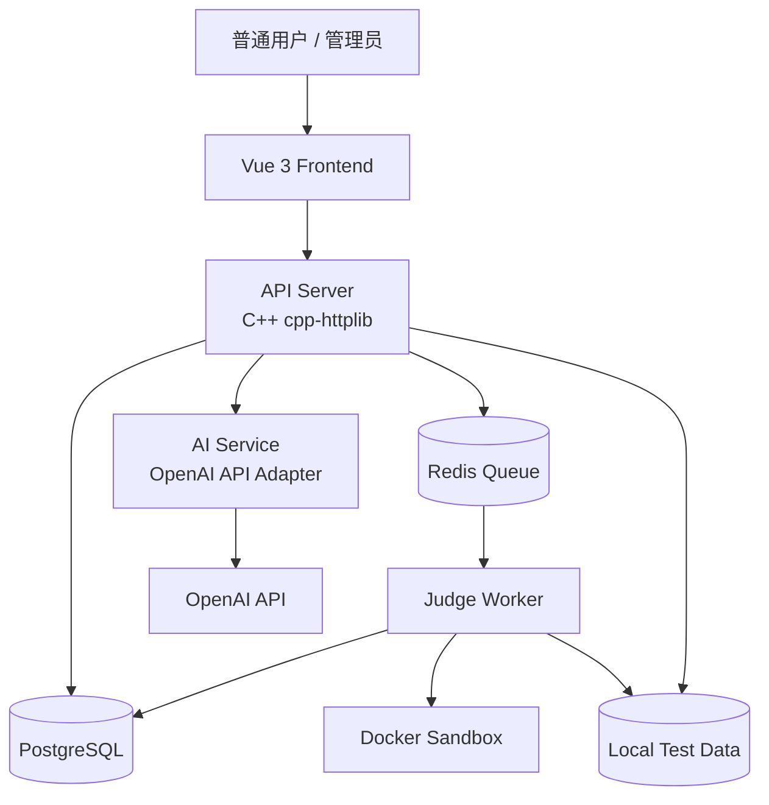
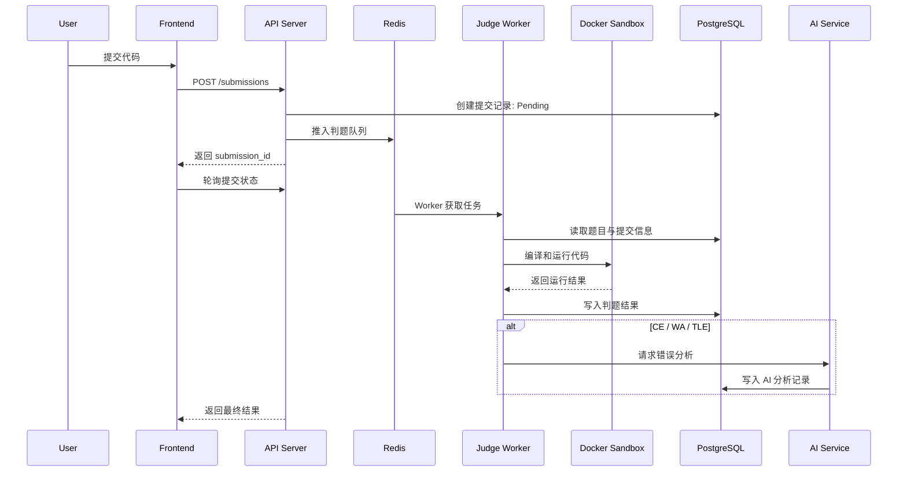

# SPEC.md - AI Native Online Judge V1

## 1. 项目目标

构建一个仿 LeetCode 的 AI Native Online Judge 平台，后端采用 C++ `cpp-httplib`，前端采用原生 Vue 3 + TypeScript。

V1 核心目标是稳定完成：

用户做题 -> 在线提交 -> Docker 安全判题 -> 查看结果 -> AI 提示与错误分析

项目定位：

- 简历级工程项目
- 可长期扩展的 OJ 平台
- 具备 AI 辅助学习能力
- 优先保证判题安全性、稳定性和可扩展性

## 2. V1 成功标准

V1 成功标准：

- 用户可以注册、登录、浏览题目、编写 C++17 代码
- 用户可以运行样例或自定义输入
- 用户可以提交代码并进入异步判题队列
- Judge Worker 使用 Docker 沙箱完成安全判题
- 用户可以查看提交结果、测试点状态、耗时、内存、错误摘要
- CE / WA / TLE 场景下可以自动触发 AI 分析
- AI 不直接输出完整 AC 代码，而是提供分层提示
- 管理员可以管理题目、测试数据，并查看提交、Worker、AI 调用记录
- 系统可部署在单台 Ubuntu 云服务器，通过 Docker Compose 启动

## 3. 非目标

V1 暂不实现：

- 多语言判题
- 排行榜
- 讨论区
- OAuth 登录
- 密码重置
- 自动补全编辑器
- Kubernetes 部署
- 复杂监控告警系统
- 标准题解解析
- 相似题推荐
- 用户删除提交记录

V1 不实现：

- LSP
- 智能补全
- 语义分析
- AI 自动补全

## 4. 用户角色

### 4.1 普通用户

能力：

- 注册、登录
- 浏览题目
- 查看题目详情
- 编写 C++17 代码
- 运行样例或自定义输入
- 提交代码
- 查看判题结果
- 查看个人提交历史
- 请求 AI Hint
- 查看 CE / WA / TLE 的 AI 分析

### 4.2 管理员

能力：

- 初始化管理员账号
- 新增、编辑、上下线题目
- 管理标签、难度
- 上传和维护测试数据
- 查看提交记录
- 查看 Worker 状态
- 查看 AI 调用记录
- 管理用户状态，V1 可先只读或基础禁用

## 5. 技术栈

### 5.1 前端

- Vue 3
- TypeScript
- Vite
- 原生 Vue 组件体系
- Monaco Editor 或 CodeMirror 作为代码编辑器
- REST API 调用
- OpenAPI V1 可先维护手写 OpenAPI 文档

理由：

- Vue 3 + TypeScript 适合快速构建前后端分离项目
- Monaco / CodeMirror 能满足代码编辑器的基础体验
- OpenAPI 类型生成可以减少接口漂移

### 5.2 后端

- C++17 / C++20
- `cpp-httplib`
- PostgreSQL
- Redis
- JWT 鉴权
- OpenAPI 文档生成
- Docker CLI / Docker Engine API 调度判题容器

理由：

- C++ 后端符合项目技术定位
- `cpp-httplib` 轻量，适合手动掌控 HTTP 层
- PostgreSQL 适合结构化业务数据
- Redis 适合异步判题队列
- Docker 沙箱隔离用户代码

### 5.3 AI

- OpenAI API
- AI Service 初期可与 API Server 共进程
- 后续可拆分为独立服务

V1 AI 功能：

- AI Hint
- 编译错误分析
- WA / TLE 原因分析
- 分层提示，不直接输出完整 AC 代码
- 调用频率限制
- 每日费用上限
- 失败降级

## 6. 系统架构



## 7. 服务拆分

### 7.1 API Server

职责：

- 用户注册登录
- JWT 鉴权
- 题目查询
- 提交创建
- 提交状态查询
- 管理员后台 API
- AI 请求入口
- OpenAPI 文档输出

### 7.2 Judge Worker

职责：

- 从 Redis 拉取判题任务
- 加载题目测试数据
- 编译 C++17 用户代码
- 启动 Docker 沙箱运行
- 收集每个测试点结果
- 写回 PostgreSQL
- 输出判题日志和 Docker 执行日志

### 7.3 AI Service

职责：

- 根据题面、用户代码、错误信息生成提示
- 分析 CE / WA / TLE
- 执行 Prompt 安全过滤
- 禁止泄露隐藏测试点输入输出
- 控制调用频率和费用上限

## 8. 判题流程



## 9. Docker 沙箱限制

默认限制：

- C++17
- CPU 时间：2s，题目可覆盖
- 内存：256MB，题目可覆盖
- 禁止网络访问
- 限制进程数
- 限制输出大小
- 超时强制终止
- 隔离文件系统
- 容器运行后清理临时文件
- 用户代码不可访问宿主机敏感路径
- 自定义输入运行也必须经过 Docker 沙箱

Docker 必须启用：

- --network none
- memory limit
- cpu quota
- pids limit
- readonly rootfs
- 临时目录隔离
- 非 root 用户运行

判题状态：

- Pending
- Judging
- Accepted
- Wrong Answer
- Time Limit Exceeded
- Memory Limit Exceeded
- Runtime Error
- Compilation Error
- System Error

状态流转：

Pending -> Judging -> FinalStatus

FinalStatus 包含：

- Accepted
- Wrong Answer
- Runtime Error
- Compilation Error
- Time Limit Exceeded
- Memory Limit Exceeded
- System Error

FinalStatus 为终态。

管理员可触发 Rejudge：

FinalStatus -> Pending

## 10. 测试数据模型

测试数据分为：

- 样例测试点
- 公开测试点
- 隐藏测试点

规则：

- 样例可展示输入输出
- 公开测试点可展示摘要，是否展示完整输入输出由管理员配置
- 隐藏测试点禁止向用户和 AI 暴露完整输入输出
- 数据库存测试数据元信息
- 本地文件系统存测试输入输出文件

## 11. 数据模型概要

关键索引：

Submission：
- user_id
- problem_id
- status
- created_at

Problem：
- difficulty
- status

## 数据库迁移规范

要求：

- 所有数据库结构变更必须通过 migration 管理
- 禁止手动修改线上数据库结构
- migration 必须具备版本号
- API Server 启动时检查 schema 版本
- 初始化 SQL 独立维护

建议目录：

backend/migrations/

核心实体：

- User
- Role
- Problem
- ProblemTag
- TestCase
- Submission
- SubmissionCaseResult
- AIAnalysis
- AIUsageLog

### Problem 字段

必须包含：

- id
- title
- description
- difficulty
- tags
- time_limit_ms
- memory_limit_mb
- default_code_template
- source
- accepted_count
- submission_count
- acceptance_rate
- status: draft / published / archived
- created_at
- updated_at

### Submission 字段

必须包含：

- id
- user_id
- problem_id
- language: cpp17
- source_code
- status
- compile_error
- total_time_ms
- peak_memory_mb
- created_at
- finished_at
- stdout
- stderr
- judge_message
- testcase_passed_count
- testcase_total_count
- ai_analysis_status
- ai_analysis_id
- code_length

用户提交源码、编译结果、运行结果和 AI 分析记录长期保存，V1 不支持用户删除。

## 12. API 规范

V1 使用 REST API。

要求：

- 统一响应格式
- 统一错误码
- 统一分页格式
- 统一权限错误格式
-  V1 可先维护手写 OpenAPI 文档
- 保留未来 gRPC 扩展可能

统一响应示例：

```json
{
  "code": "OK",
  "message": "success",
  "data": {},
  "request_id": "req_xxx"
}
```

分页响应示例：

```json
{
  "code": "OK",
  "message": "success",
  "data": {
    "items": [],
    "page": 1,
    "page_size": 20,
    "total": 100
  }
}
```

核心 API：

- `POST /api/auth/register`
- `POST /api/auth/login`
- `GET /api/v1/problems`
- `GET /api/v1/problems/{id}`
- `POST /api/submissions`
- `GET /api/submissions/{id}`
- `GET /api/me/submissions`
- `POST /api/run`
- `POST /api/ai/hint`
- `GET /api/admin/problems`
- `POST /api/admin/problems`
- `PUT /api/admin/problems/{id}`
- `POST /api/admin/problems/{id}/testcases`
- `GET /api/admin/submissions`
- `GET /api/admin/workers`
- `GET /api/admin/ai-logs`

JWT 规范：

- 使用 Authorization: Bearer Token
- Token 默认有效期：7 天
- Token 包含：
  - user_id
  - role
- V1 暂不实现 Refresh Token
- 管理员接口必须校验 role

V1 必须具备基础限流：

- 登录接口限流
- 提交接口限流
- AI 接口限流
- IP 级别限流
- 用户级别限流

## 13. 前端页面范围

### 普通用户端

必须包含：

- 首页
- 登录页
- 注册页
- 题目列表页
- 题目详情页
- 代码编辑器
- 提交记录页
- 个人提交历史页

代码编辑器必须支持：

- C++17 语法高亮
- 主题切换
- 字体大小调整
- 默认代码模板
- 运行快捷键
- 运行样例
- 自定义输入运行
- 提交代码

### 管理员后台

必须包含：

- 题目管理
- 标签管理
- 难度管理
- 测试数据管理
- 提交记录查看
- Worker 状态查看
- AI 调用记录查看

编辑权限：

- 题目可编辑
- 测试数据可编辑
- 标签和难度可管理
- 提交记录、Worker、AI 记录以只读为主

## 14. AI 策略

V1 必须支持：

- AI Hint
- 编译错误分析
- WA 原因分析
- TLE 原因分析

AI 可访问：

- 题面
- 用户代码
- 编译错误
- 失败测试点摘要
- 判题状态

AI 禁止访问：

- 隐藏测试点完整输入
- 隐藏测试点完整输出
- 管理员内部备注
- 其他用户代码

AI 输出规则：

- 不直接生成完整 AC 代码
- 使用分层提示
- 优先指出思路方向、边界条件、复杂度问题
- 对 CE 给出错误位置和修复建议
- 对 WA 给出可能原因，不泄露隐藏数据
- 对 TLE 分析复杂度和热点逻辑

AI 分析必须异步执行：

- 判题主流程不得阻塞等待 AI
- AI 超时不得影响提交最终状态
- AI 分析结果允许延迟返回

## 15. 非功能需求

### 性能

V1 目标：

- 数千注册用户
- 20~50 同时在线用户
- 5~10 个并发判题任务
- 数千级单日提交量

### 可扩展性

要求：

- API Server 与 Judge Worker 解耦
- Redis 队列支持多 Worker 扩展
- AI Service 可后续独立部署
- 测试数据采用元数据与文件分离
- 题目级时间和内存限制可配置

### 安全

重点防御：

- Docker 沙箱逃逸
- 恶意资源占用
- SQL 注入
- JWT 越权
- 管理员接口越权
- AI 泄露隐藏测试数据
- Prompt Injection
- 恶意大输出撑爆磁盘

### 可观测性

V1 必须具备：

- 提交日志
- 判题日志
- Docker 执行日志
- AI 调用日志
- Worker 状态查看

暂不要求：

- Prometheus
- Grafana
- 自动告警系统

日志要求：

- request_id 全链路追踪
- API 访问日志
- 判题日志
- Docker 执行日志
- AI 调用日志
- 错误日志分级

## 16. 失败与降级策略

### Redis 不可用

- 新提交返回系统错误
- 已创建但未入队任务标记为 System Error 或等待重试
- 写入错误日志

### Judge Worker 不可用

- Worker 状态可通过 Redis 或内存维护
	V1 不强制持久化 Worker 实体

### Docker 不可用

- 当前任务标记为 System Error
- 自动重试有限次数
- 记录 Docker 执行日志

### AI Service 不可用

- 判题主流程不受影响
- AI 功能显示暂不可用
- 可稍后重试 AI 分析

### OpenAI API 不可用

- 关闭 AI 功能或返回降级提示
- 不影响正常判题
- 记录调用失败
- 不重复无限重试

## 17. 部署方式

V1 部署目标：

- 单台 Ubuntu 云服务器
- Docker Compose

容器：

- frontend
- api-server
- judge-worker
- postgres
- redis

AI Service 初期可与 API Server 共进程，后续拆分为独立容器。

## 18. 建议目录结构

```txt
project-root/
  backend/
    api-server/
    judge-worker/
    common/
    openapi/
    CMakeLists.txt

  frontend/
    src/
      api/
      pages/
      components/
      stores/
      router/
      types/

  deploy/
    docker-compose.yml
    nginx/
    postgres/
    redis/

  testdata/
    problems/
      {problem_id}/
        samples/
        public/
        hidden/

  docs/
    SPEC.md
    API.md
    SECURITY.md

  scripts/
    init_admin.sh
    migrate_db.sh
```

## 19. 分阶段迭代计划

### Phase 1: 项目骨架

- 前后端分离目录结构
- Docker Compose 基础环境
- PostgreSQL / Redis 初始化
- API Server 基础 HTTP 服务
- 前端基础路由和页面框架
- OpenAPI 文档输出

### Phase 2: 用户与题库

- 注册登录
- JWT 鉴权
- 管理员初始化
- 题目列表
- 题目详情
- 管理员题目管理
- 测试数据上传

### Phase 3: 判题闭环

- 提交创建
- Redis 判题队列
- Judge Worker
- Docker 沙箱编译运行
- 测试点结果写回
- 前端轮询提交结果
- 个人提交历史

### Phase 4: AI 辅助

- AI Hint
- CE 分析
- WA / TLE 分析
- Prompt 安全边界
- 频率限制
- 每日费用上限
- AI 调用日志

### Phase 5: 管理后台与稳定性

- Worker 状态查看
- 提交记录管理
- AI 调用记录查看
- 错误码完善
- 日志完善
- 核心验收测试

## 20. TODO 清单

### 后端

- [ ] 搭建 C++ `cpp-httplib` API Server
- [ ] 接入 PostgreSQL
- [ ] 接入 Redis
- [ ] 实现 JWT 鉴权
- [ ] 实现统一响应格式
- [ ] 实现错误码规范
- [ ] 实现分页规范
- [ ] 生成 OpenAPI 文档
- [ ] 实现题目 API
- [ ] 实现提交 API
- [ ] 实现管理员 API
- [ ] 实现 AI API

### Judge Worker

- [ ] 实现 Redis 任务消费
- [ ] 实现 C++17 编译流程
- [ ] 实现 Docker 沙箱运行
- [ ] 实现 CPU / 内存 / 输出限制
- [ ] 实现测试点逐个判定
- [ ] 实现判题结果写回
- [ ] 实现 Docker 执行日志
- [ ] 实现 Worker 心跳状态

### 前端

- [ ] 登录注册页
- [ ] 首页
- [ ] 题目列表页
- [ ] 题目详情页
- [ ] 代码编辑器
- [ ] 运行代码
- [ ] 提交代码
- [ ] 提交结果轮询
- [ ] 个人提交历史
- [ ] 管理员后台

### AI

- [ ] 接入 OpenAI API
- [ ] 实现 Hint
- [ ] 实现 CE 分析
- [ ] 实现 WA 分析
- [ ] 实现 TLE 分析
- [ ] 实现 Prompt Injection 防护
- [ ] 实现隐藏测试点脱敏
- [ ] 实现频率限制
- [ ] 实现每日费用上限
- [ ] 实现失败降级

### 部署

- [ ] 编写 Dockerfile
- [ ] 编写 Docker Compose
- [ ] 配置 PostgreSQL 数据卷
- [ ] 配置 Redis
- [ ] 配置测试数据挂载目录
- [ ] 配置前端静态资源服务
- [ ] 配置环境变量
- [ ] 编写初始化管理员脚本

## 21. 验收标准

### 用户流程

- [ ] 用户可以注册并登录
- [ ] 用户登录后可以浏览题目列表
- [ ] 用户可以进入题目详情页
- [ ] 用户可以看到默认 C++17 模板代码
- [ ] 用户可以运行样例
- [ ] 用户可以使用自定义输入运行代码
- [ ] 用户可以正式提交代码
- [ ] 提交后前端通过轮询获取状态
- [ ] 用户可以查看个人提交历史

### 判题场景

- [ ] 正确代码返回 Accepted
- [ ] 错误输出返回 Wrong Answer
- [ ] 死循环代码返回 Time Limit Exceeded
- [ ] 超内存代码返回 Memory Limit Exceeded
- [ ] 运行时崩溃返回 Runtime Error
- [ ] 编译失败返回 Compilation Error
- [ ] Docker 执行失败返回 System Error
- [ ] 每个测试点展示状态、耗时、内存和错误摘要
- [ ] 隐藏测试点输入输出不会暴露给用户

### AI 场景

- [ ] CE 后自动生成编译错误分析
- [ ] WA 后自动生成原因分析
- [ ] TLE 后自动生成复杂度或死循环分析
- [ ] 用户可以手动请求 Hint
- [ ] AI 不直接输出完整 AC 代码
- [ ] AI 不暴露隐藏测试点输入输出
- [ ] OpenAI API 不可用时不影响正常判题

### 管理员场景

- [ ] 管理员可以新增题目
- [ ] 管理员可以编辑题目
- [ ] 管理员可以上下线题目
- [ ] 管理员可以上传样例、公开、隐藏测试数据
- [ ] 管理员可以查看提交记录
- [ ] 管理员可以查看 Worker 状态
- [ ] 管理员可以查看 AI 调用记录

### 安全场景

- [ ] 未登录用户不能提交代码
- [ ] 普通用户不能访问管理员 API
- [ ] JWT 过期后请求被拒绝
- [ ] 用户代码不能访问网络
- [ ] 用户代码不能读取宿主机敏感文件
- [ ] 恶意大输出会被截断并终止
- [ ] Prompt Injection 不能诱导 AI 泄露隐藏测试数据

## 22. V1 总结

V1 不是单纯的刷题网站，而是一个以 Docker 安全判题和 AI 辅助学习为核心的 AI Native OJ 平台。

优先级顺序：

1. 判题安全稳定
2. 用户做题闭环完整
3. AI 提示与错误分析可用
4. 管理后台满足基础运维
5. 架构保留后续扩展空间
